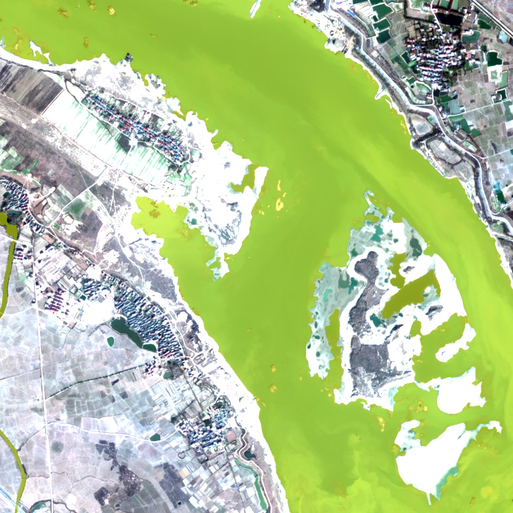
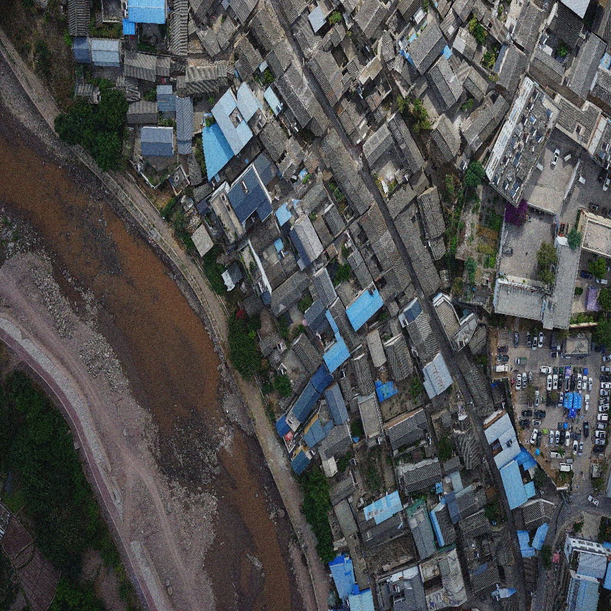
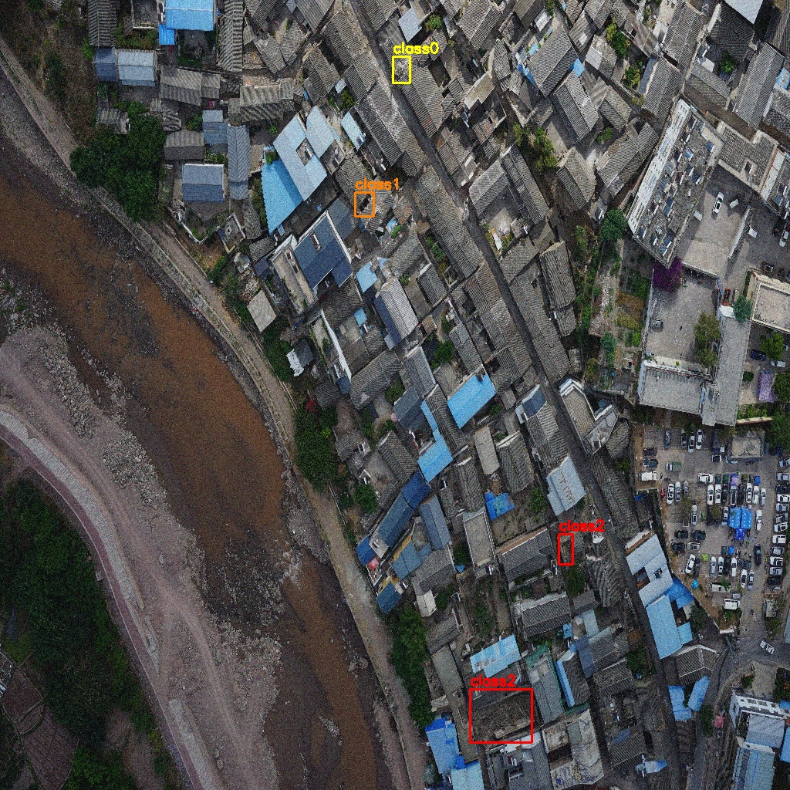

<div align="center">

</img> 

**一个能够并行处理多源数据形成完整信息链，适应不同任务场景，提供快速，精准的应急方案的多模态智能体。**

 <a>🤖</a> | 
[🍳 演示文档](./多模态台风应急减灾智能体.pptx) |
[📄 材料报告](./材料文档.pdf) 


---

<div align="center">

# Dragent for Disaster Reduce

</div>

## ⚠️ 此项目需要额外依赖：
>- Node.js 
>- npm 
>- pnpm
>- python 3.11+

---
## 部署
1. 克隆项目（如果文件夹内已有，跳过此步）
```bash
git clone https://github.com:Nehemiab/dragent.git
cd dragent
```
2. 安装依赖
```bash
pip install -r requirements.txt
pip install -U "langgraph-cli[inmem]"
cd ./agent-chat-ui
pnpm install
```
3.启动专家智能体服务
```bash
#显卡服务器上运行
#vllm==0.9.2 python3.10
#实验使用环境是代码目录 之外 的envs中的env1
cd MLLM/
vllm serve model  --dtype auto --max-model-len 2048 --api-key token-abc123 --gpu_memory_utilization 0.9 --trust-remote-code --enable-lora  --lora-modules lora1=sft_water lora2=sft_housing lora3=sft_road
#端口号8000
```
4.启动mask-rcnn服务(可选，需修改dragent_tool/gen_mask.py中的接口)
```bash
#显卡服务器上运行
#环境要求：detectron2==0.6(git本地编译安装）, opencv-python==4.12.0.88 ,requests== 2.32.4,uvicorn==0.35.0,fastapi==0.116.1,python3.10
#实验使用环境是代码目录 之外 的envs中的env1
cd MLLM/
python gen_maskrcnn_service.py
#端口号9000
```
3.启动langgraph服务
```
#环境要求：代码目录下的.ui虚拟环境
在./langgraph.json中修改graph为所需的智能体
#e.g.:"typhoon_disaster_agent":"./pre_disaster.py:pre"
#     "typhoon_disaster_agent":"./during_disaster.py:during"
#     "typhoon_disaster_agent":"./post_disaster_rebuild.py:post"
```
```bash
langgraph dev
```
4. 启动前端服务
```bash
cd ./agent-chat-ui
pnpm dev
```
5. 打开浏览器，访问前端输出的网址
```
YOUR_URL_IS_LISTED_ON_CLI
```
---
### DEMO 使用数据
- 台风数据
```aiignore
广东省梅州市（纬度 24.3，经度 116.1）
```

- 水体图片


- 水体掩膜图片



- 城镇遥感图片



- 房屋框选图片

